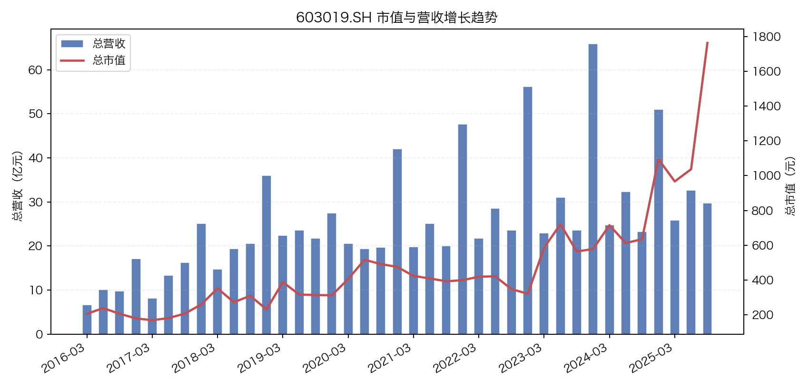
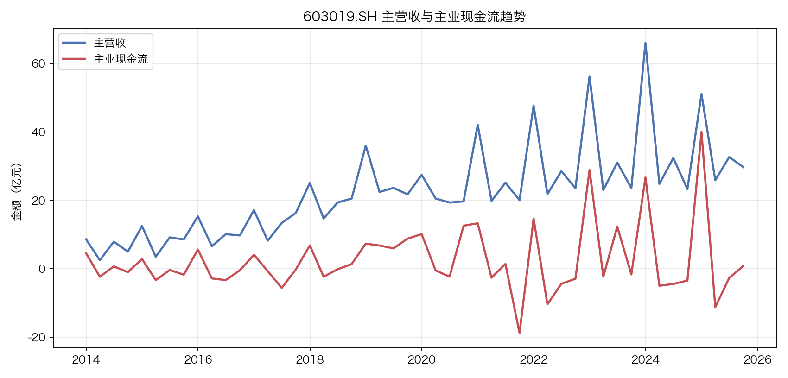
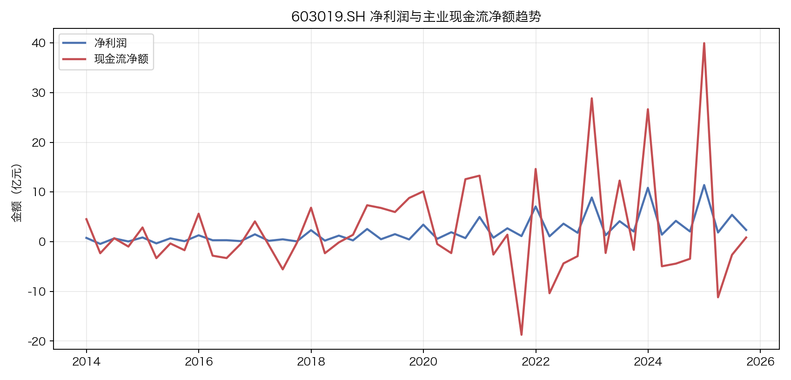
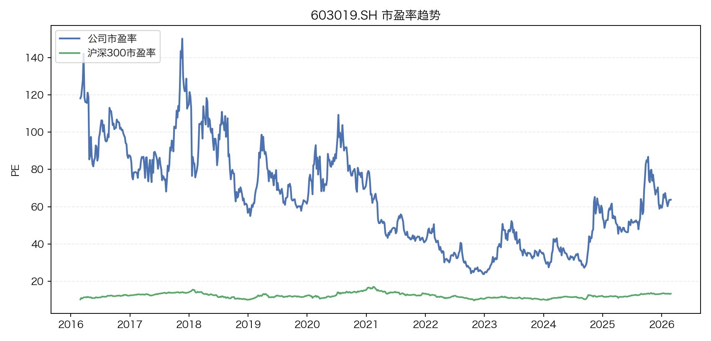
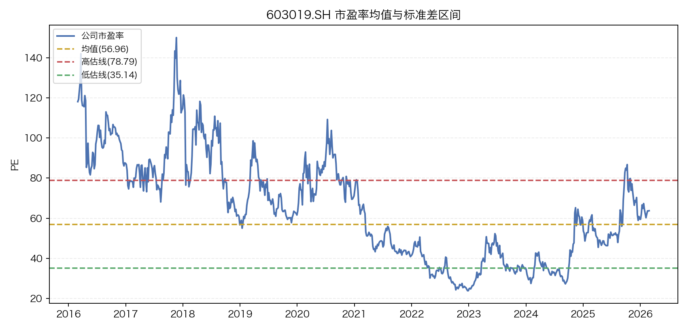
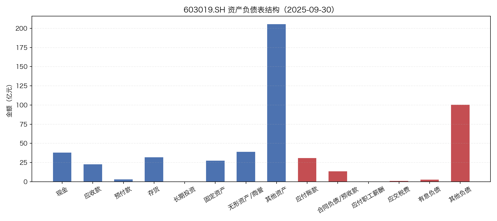
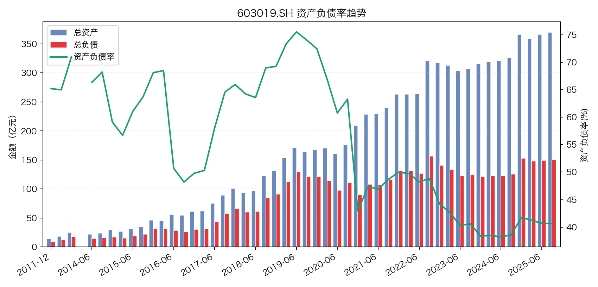

# 603019.SH 公司分析卡

- 生成时间：2026-02-26 19:18:15
- 数据截止：2026-02-26
- 市场：CN
- 币种：CNY
- 汇率（1 CNY = ? CNY）：1.000000

## 核心结论（MVP）

- 经营质量：ROE=N/A，资产负债率=41.76%。
- 成长性：营收同比=-8.40%，净利润同比=4.10%。
- 现金流：经营现金流/净利润=1.42，最新经营现金流=2,721,815,770.05。
- 市场表现：最新收盘价=92.03，区间涨跌幅=12.16%。

## 关键指标快照

| 指标 | 数值 |
| --- | ---: |
| 最新市值 | 1,346.51 |
| 最新市值（CNY） | 1,346.51 |
| 最新营收 | 13,147,685,135.79 |
| 最新营收（CNY） | 13,147,685,135.79 |
| 最新净利润 | 1,911,152,257.13 |
| 最新净利润（CNY） | 1,911,152,257.13 |
| 最新经营现金流 | 2,721,815,770.05 |
| 最新经营现金流（CNY） | 2,721,815,770.05 |
| 最新 ROE | N/A |
| 最新资产负债率 | 41.76% |

## 数据覆盖

| 数据集 | 行数 |
| --- | ---: |
| price_history | 2450 |
| market_cap_history | 731 |
| financial_indicators | 14 |
| financial_indicators_quarterly | 50 |
| pe_history | 731 |
| hs300_pe_history | 5073 |
| industry_pe_history | 0 |
| industry_roe_history | 0 |
| balance_components | 14 |

## 图表

### 市值与营收增长趋势

### 主营收与主业现金流趋势

### 净利润与主业现金流净额趋势

### 市盈率对比趋势

### PE均值与标准差区间

### 资产负债结构（单期）

### 资产负债率趋势

## 说明

- 本报告用于投研辅助，不构成投资建议。
- 口径统一规则见 `docs/架构与设计说明.md`。
- 若指标缺失，通常表示上游接口无值或字段待映射。
