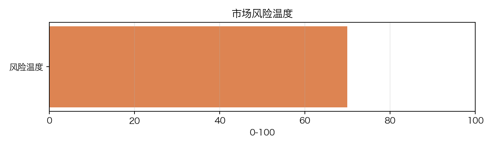
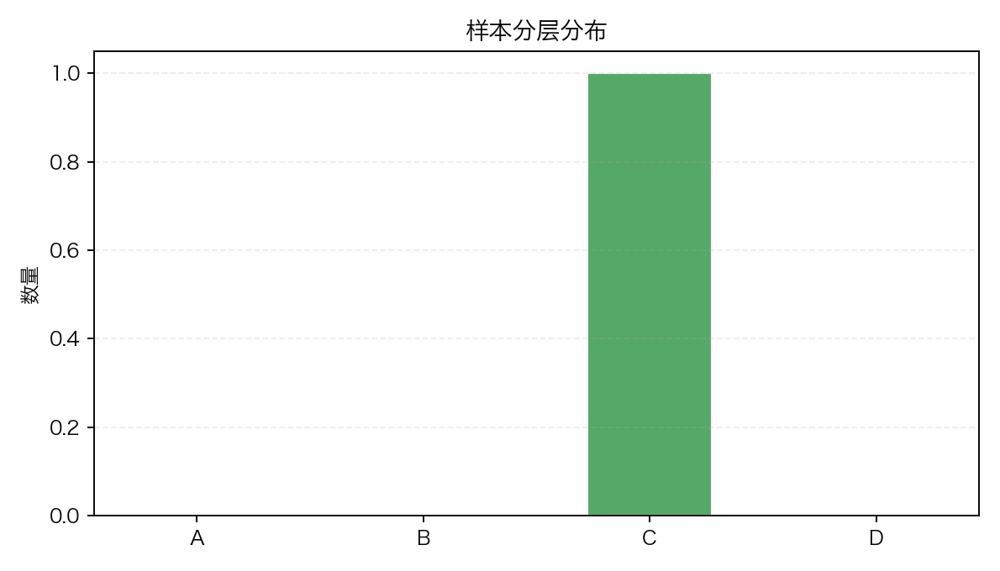
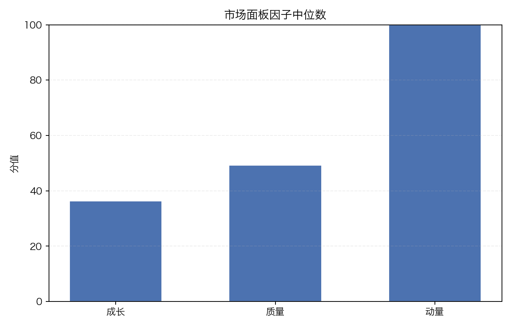

# 市场择时面板

- 生成时间：2026-02-26 22:58:46
- 数据截止：2026-02-26
- 样本数量：1

## 核心判断

- 风险偏好温度：69.97 / 100
- 市场状态：偏多
- 建议仓位区间：60%-80%

## 因子中位数

| 因子 | 分值 |
| --- | ---: |
| 总分中位数 | 59.97 |
| 成长因子中位数 | 36.34 |
| 质量因子中位数 | 49.28 |
| 动量因子中位数 | 100.00 |
| 市场广度（正收益占比） | 100.00% |

## 评分靠前标的

| 排名 | 代码 | 总分 | 分层 |
| --- | --- | ---: | --- |
| 1 | 000651.SZ | 59.97 | C |

## 评分靠后标的

| 排名 | 代码 | 总分 | 分层 |
| --- | --- | ---: | --- |
| 1 | 000651.SZ | 59.97 | C |

## 图表

### 市场风险温度

### 样本分层分布

### 市场面板因子中位数

## 风险提示与说明

- 风险偏好较高，可在控制回撤前提下提升仓位。
- 市场广度（区间收益为正占比）为 100.00%。
- 样本成长因子整体偏弱，需关注业绩兑现风险。
- 本面板用于投研辅助，不构成投资建议。
- 建议结合行业景气与事件催化做人工复核。
