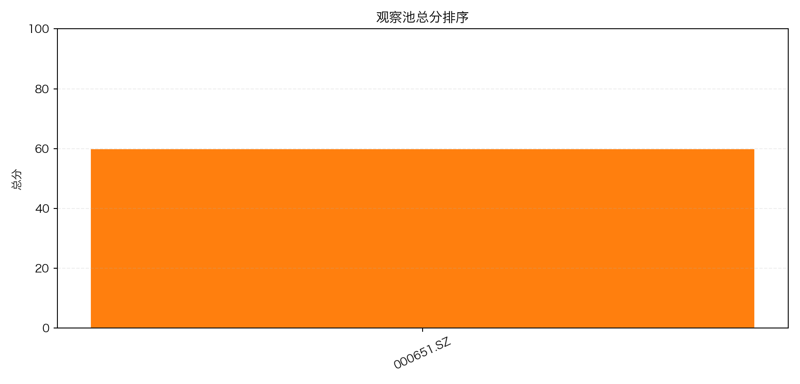
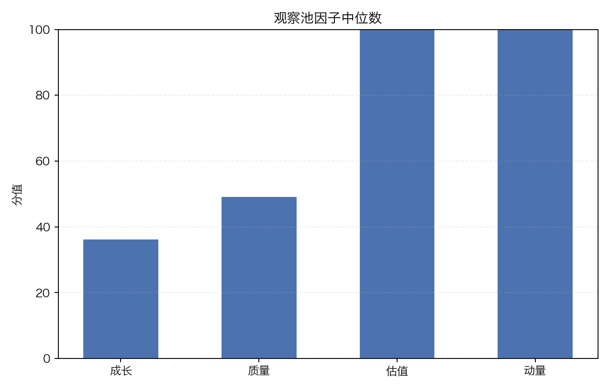

# 观察池评分报告

- 生成时间：2026-02-26 22:58:46
- 标的数量：1

## 排名总览

| 排名 | 股票代码 | 总分 | 分层 | 成长 | 质量 | 估值 | 动量 |
| --- | --- | ---: | --- | ---: | ---: | ---: | ---: |
| 1 | 000651.SZ | 59.97 | C | 36.34 | 49.28 | 100.00 | 100.00 |

## 逐标的结论

### 000651.SZ（C）

- 总分：59.97
- 截止日期：2026-02-26
- 成长性偏弱：营收或净利润增速不足。
- 股价动量偏强：样本区间内价格趋势向上。

## 图表

### 观察池总分排序

### 观察池因子中位数

## 说明

- 该评分用于研究排序，不构成投资建议。
- 当前为 MVP 规则，后续可按行业与风格做参数分层。
